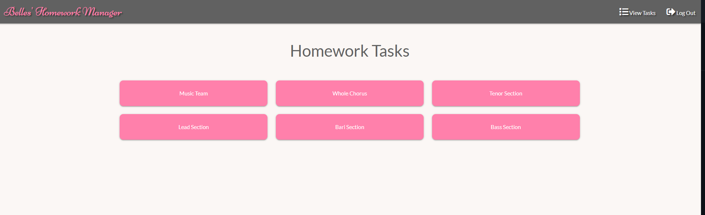
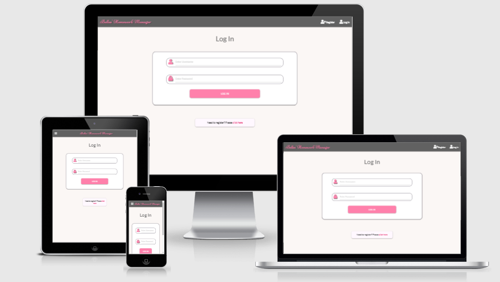
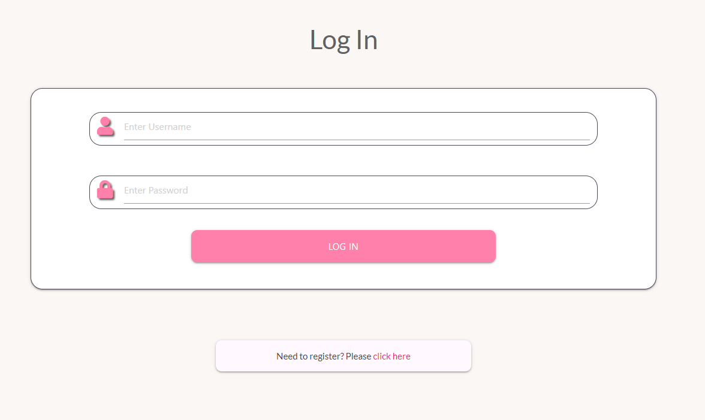
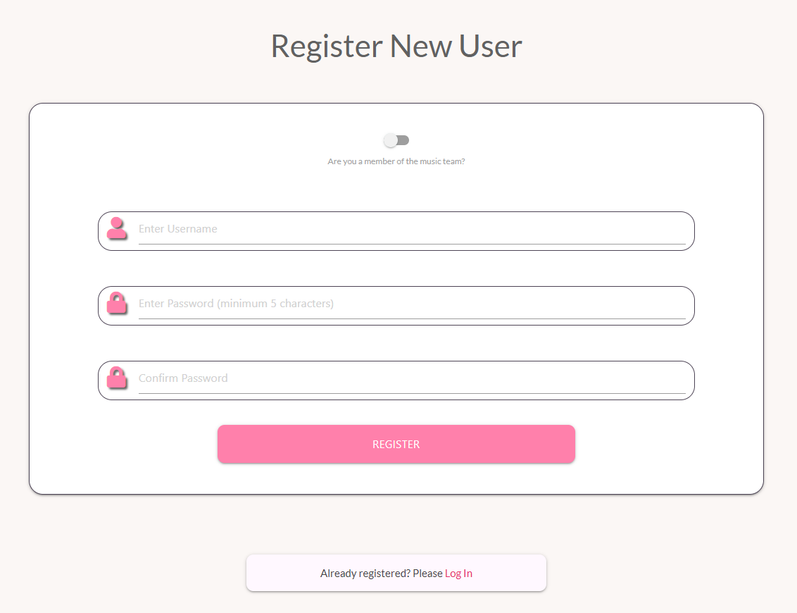
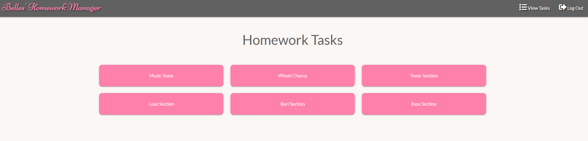
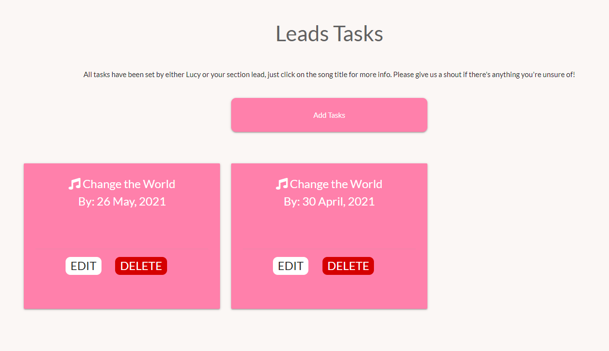
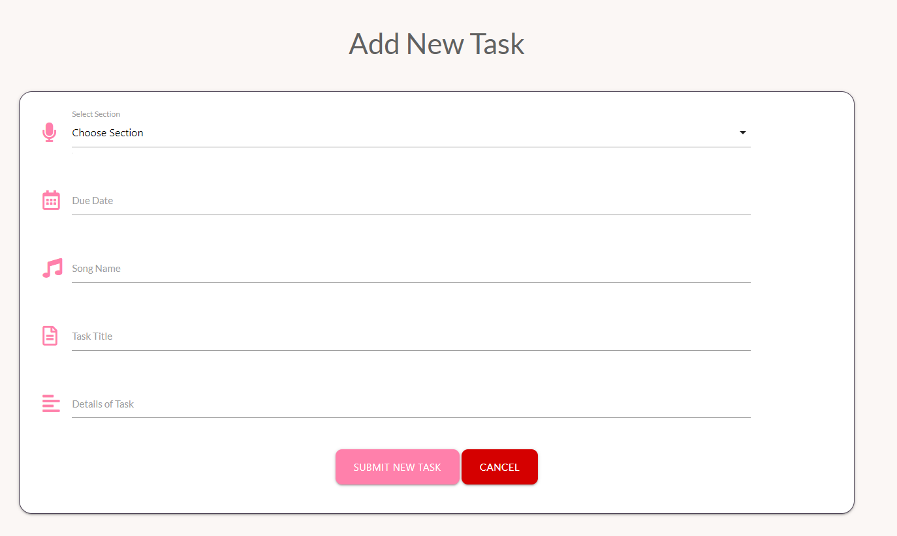
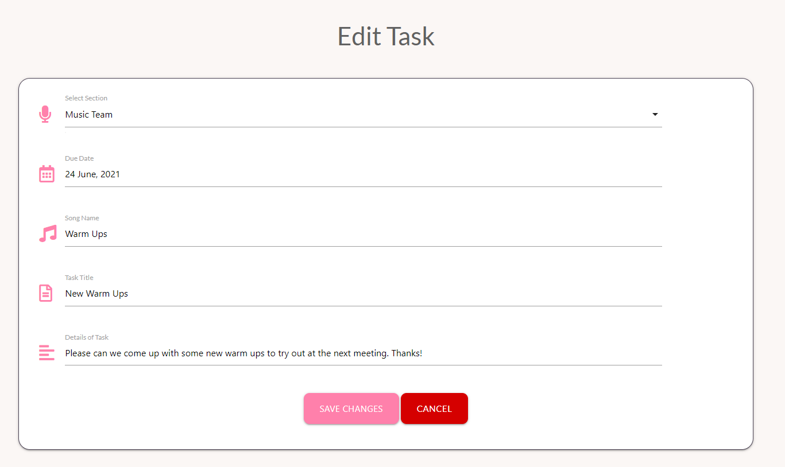

# The Belles of Three Spires Homework Tracker
## A Milestone 3 Project by Rachel Sherlock

[View the live project](http://belles-task-manager.herokuapp.com/login)

This website was designed to create a homework tracker for the Belles of Three Spires Barbershop Chorus. It will enable the Belles' music team to be able to set homework for the rest of the chorus, All other members of the chorus will be able to see which part of which song they should be prioritising.

## User Experience (UX)

* **User Stories** 
    * **As a member of the music team**
        1. I want to be able to set tasks for my section so that they know what part of the tracks we neeed to prioritise next.
        2. I want to be able to see what tasks have been set by other members of the music team for their sections
        3. I want to be able to see what tasks have been set for me in the music team tasks section
        4. I want to be able to see what tasks have been set for the whole chorus

    * **As a Non-music team member of the chorus**
        1. I want to be able to see what tasks my section lead has set for me
        2. I want to be able to see what tasks have been set for the whole chorus
    
    * **As the director of the chorus**
        1. I want to be able to set tasks for the individual sections to be able to tell them which specific parts of the tracks they need to work on
        2. I want to be able to communicate tasks and messages to the whole chorus 
        3. I want to be able to set taks for the music team to tell them what we need to be working on next.

## Testing

[View the full TESTING.md documentation](TESTING.md)

## Design

### Colour Scheme

The main colours chosen for the site are hot pink and charcoal grey.

The Belles singout outfit consists of a fleece jacket in a similar colour to that used on the site. As the hot pink
is a bright and modern colour, I have paired it with the classic dark grey of the header, footer and text boxes. This makes the site 
aesthetically pleasing and the good contrast makes the site easy to read. The body of the site has a very pale whitesmoke background colour. This ties the two main colours together
as well as making the site more comfortable to navigate.   

The charcoal grey of the header is also used throughout the body of the site in text boxes. 

### Typography

There are two main fonts used in the site. Niconne, with a backup of the cursive font is used for "The Belles of 
Three Spires" in the header. This font is similar to the font that is used by the Belles on their marketing 
material. All other text uses the lato font, with the backup font of sans serif. This is a clean and easy to read font 
which fits in with the simple style of the site and also contrasts nicely with the script of the headers.

### Wireframes

The wireframes for the site were created in balsamiq and uploaded as a pdf. They can be found as a pdf file [here.](https://github.com/Rachel2308/MS3-belles-task-manager/blob/master/Homework-Tracker-Wireframe%20pdf.pdf)

---

## Features

### Users

There are 2 levels of user for the site, this is selected on the registration form by checking the "Music Team" button. This will tag the user as either being a member of the music team, or a standard member. Only a member of the music team can add tasks, or edit and delete existing tasks.

### Existing Features

The site is responsive across all screen sizes. The layout of the pages change depending on the size of screen. This has created a tidy and clean look on all screens.

### 1. Log in / Registration Page
* The log in and registration pages are acccessed when a user first accesses the site. The pages link between the 2 pages so that users can easily select whether they need to log in or register.

### 2. Registration Page
* The registration page enables a user to create an account. This is where they can create their username and password to log on to the site with, and also specify whether or not they are a member of the music team.

### 3. Homework Tasks Page
* This page holds the links to all of the section pages. Users will click on the relevant link and get taken to the page holding the tasks that they need to follow.

### 4. Section Pages
* There are 6 individual section pages, one for each musical section, one for the music team, and one for the whole chorus. The tasks are filtered into these pages depending on which section they are allocated to when the tasks are added. This page also has the link to add a new task, and when a member of the music team is logged in, they can edit or delete the tasks from here too. 

### 5. Add Task
* New tasks can be added from the Add New Task page that is linked from the individual section pages. This is where a member of the music team can add a task. In selecting the correct section from the dropdown section at the top of the form, the task will be correctly filtered into the relevant section page. 

### 6. Edit / Delete Tasks
* Existing tasks can be edited or deleted from the cards on the section pages. When a task is edited, it will have the existing data prefilled into the form to make it easier to edit correctly. When the user selects to delete a task, a pop up box will appear to check whether the user would like to delete the task. The edit and delete buttons are only available when a user is logged in as a member of the music team.

### Features Left To Implement

1. A feedback feature, where users can mark when they have completed the task would be a useful future addition on the site.

2. Personalised tasks that can be sent to individual members rather than the whole section or chorus would help with members progress

### Features Changed from Original Wireframe

### 1. Calendar
Originally I wanted to have a google calendar linked to the front page of the site where the members of the Belles can see any events that are coming up. Once this was embedded it did not look right for the site
and it is not possible to change the look of the calendar within the page. The colour scheme did not work with the rest of the site and I therefore made the decision to delete this from the site. 

### 2. Add Task Button
Originally I had planned to have this on the header, however after user testing, I made the decision to include this on the individual section pages above the existing tasks. This feels like a more intuitive place to have the feature.

### 3. Task Cards
As my skills evolved throughout the building of the project, I decided to make the task cards only display the song title and due date of the task, with the rest being viewed after clicking the card. This improves the aesthetics of the site by keeping the pages looking cleaner. 

---

## Frameworks, Libraries & Programmes Used

1. [Materialize](https://materializecss.com/) 
    * Materialize was used to help with the styling and responsiveness of the site.
2. [Google Fonts:](https://fonts.google.com/) 
    * Google fonts were used to import the Lato and Niconne fonts which are used throughout the site.
3. [Font Awesome:](https://fontawesome.com/) 
    * Font Awesome was used for the icons on the footer links, and the musical notes on the task cards, pon the header and on the log in and registration forms.
4. [jQuery:](https://jquery.com/) 
    * jQuery was used in conjunction with Materialize across the site.
5. [Git:](https://git-scm.com/) 
    * Git was used for version control by utilising the Gitpod terminal to commit to Git and Push to GitHub.
6. [GitHub:](https://github.com/) 
    * GitHub is used to store the project's code after being pushed from Git.
7. [Balsamiq:](https://balsamiq.com/) 
    * Balsamiq was used to design the site and create [wireframes](documentation/images/Homework-Tracker-Wireframe-pdf.pdf).
8. [Heroku:](https://heroku.com) 
    * Heroku was used to host the deployed site
9. [MongoDB](https://www.mongodb.com/)
    * MongoDB was used for the database for the site
8. Languages used
    * HTML
    * CSS
    * Python
    * Javascript
 

---

## Deployment

The Belles' Homework Manager was created on Gitpod. Commits to git pushed the project to the GitHub repository. The project was deployed to Heroku for the live site
and the pushes to GitHub automatically pushed to Heroku to update the live site. 

**Running Belles Task Manager Online Locally**

### **GitHub**

How to clone Belles' Task Manager from GitHub

Please note that this project will only run locally if am env.py file is set up containing the IP, PORT, SECRET_KEY, MONGO-URI and MONGO_DBNAME. 
For security reasons these details will not be shared on this documentation. The env.py file should be added to your gitignore file.

1. Navigate to rachel2308/MS3-belles-task-manager
2. Click on the green Code button
3. Select the code dropdown button beside the Gitpod button
4. Copy the URL listed.
5. Start up your IDE and navigate to the file location.
6. To clone, copy this code and input it into your terminal:

https://github.com/Rachel2308/MS3-belles-task-manager

### **Heroku**

**Deployment to Heroku**

**Create the application:**

    * Login in to heroku.com
    * Click on New, and Create new app
    * Enter your app name
    * Select the region that is closest to you

**Connect to you GitHub repository**

    * Click Deploy and select GitHub - Connect to GitHub
    * Enter your repository name and search
    * Click Connect on the correct repository

**Set Your Environment Variables**

Go to settings, and within Config Vars enter the following

    * IP: 0.0.0.0
    * PORT: 5000
    * MONGO_DBNAME: (enter the database name that you are connecting to)
    * MONGO_URI: (enter your mongo uri. This is found by going to clusters> connect> connect to your application and entering your passwords and dbname within the link)
    * SECRET_KEY: (This is a secret password that must be very secure.)

**Enable Automatic Deploys**

    * Go to the deploy tab
    * Within the automatic deploys section, choose the branch that you want to deploy from and select Enable Automatic Deploys. 

---

## Credits

### Code

* The code that formed the basis of the project is based on the code from the Task Manager App Walkthrough project on the LMS. 
* Code for the forms, modal and navbars were adapted from the materialize framework.

### Acknowledgements

Thanks to 

* My mentor Aaron Sinnot for his guidance
* All the tutors, but especially Scott for his unending support, while somehow still maintaining the patience of a saint!
* The Slack community, in particular Ed B_Lead. His support, both emotional and with the coding has been a huge help in enabling me to get through this project relatively unscathed.

---
