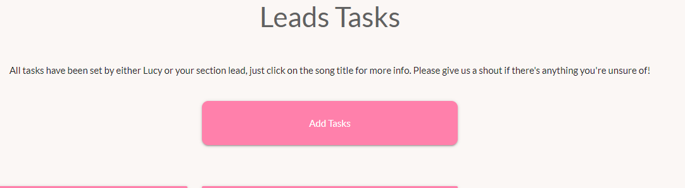
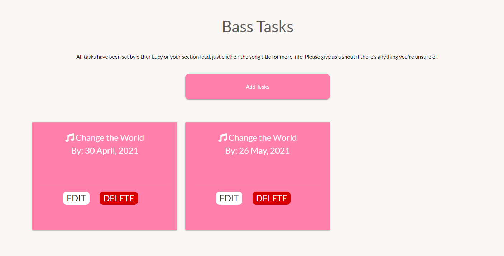
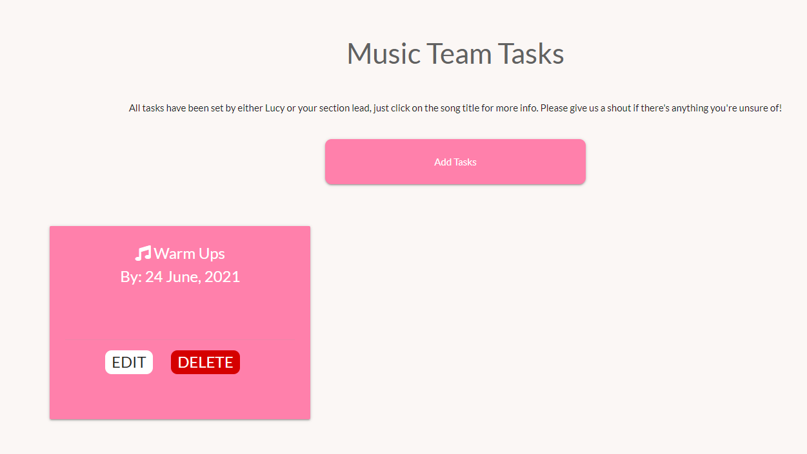
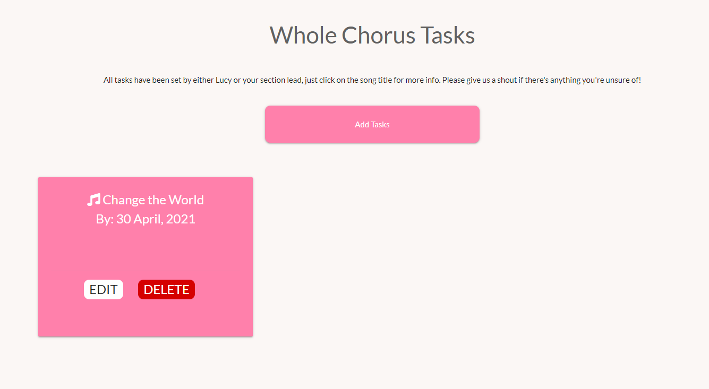
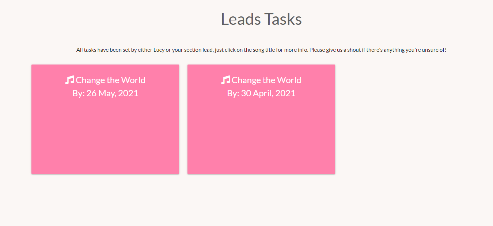
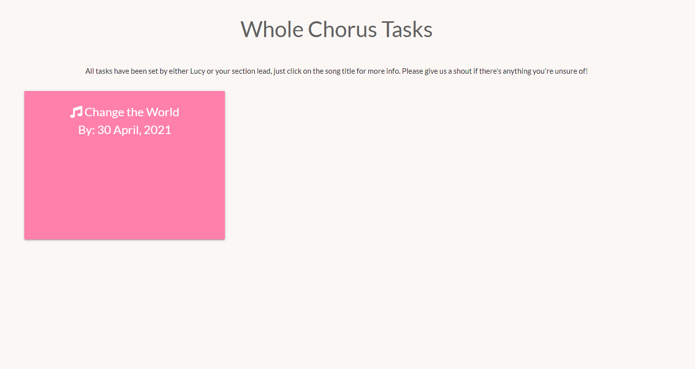
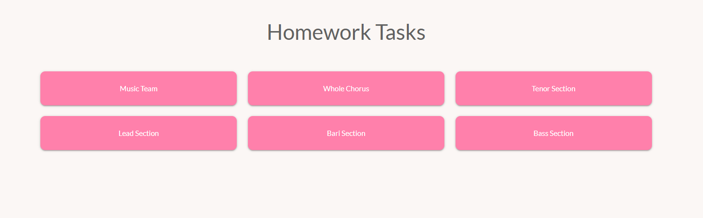
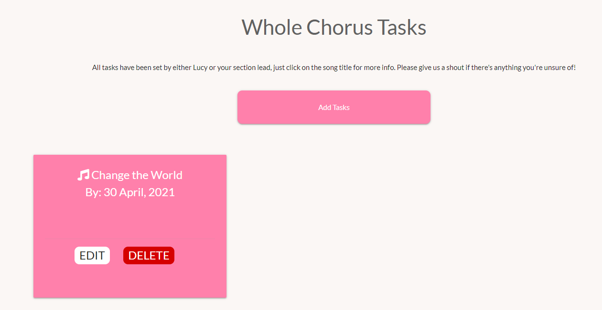
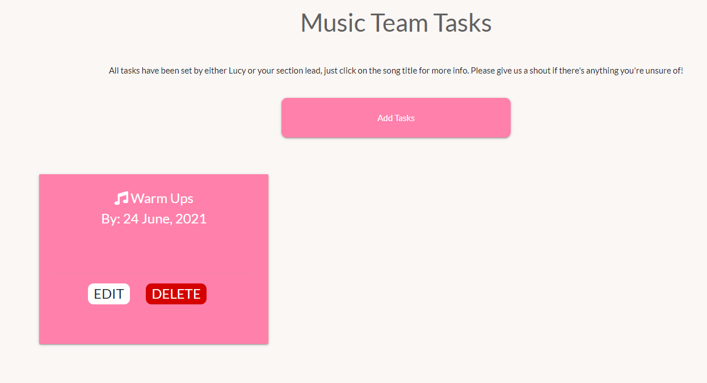

# Testing

## **Bugs**

* **Issue**
  
  Form did not show all of the placeholder text in smaller screen

    **Fix**
  
  Form and text boxes made wider for small screens

  ---

* **Issue**

    Title in header too big for smaller screen and drops down outside of the header

    **Fix**

    Media Queries used to use smaller text as screen size gets smaller

---

*   **Issue**

    Card panels jumped up and caused lower card panel to move to the bottom of the page when opened.

    **Fix**

    Realised that it was due to the card class being used to change the height of the card. Changed the CSS to use the card-title class. Cards now function as intended

*   **Issue**

    The flash on login now says Welcome, None

    **Fix**

    Corrected the code in app.py from users to username

    **Issue**

    When updating the tasks, the task changed to "Whole Chorus"

    **Fix**

    Amended code from  to 

    **Issue**

    The Belles of Three Spires text in the header will take the user to the homework.html page even when not logged in causing errors. 

    **Fix**
    
    If statement added to base.html so that link goes to Login page if not logged in otherwise it links to the View Tasks page

    **Issue**

    Deleting a task deleted the first task on the page, not the current

    **Fix**

    Code amended to target the current task

    **Issue**

    Deleting a task takes user back to main task page. Not great UX

    **Fix**

    Created @app.route entry for each section so that the delete button in the modal would route back to the section page. 

    **Issue**

    Editing a task takes user back to main task page. Not great UX

    **Fix**

    Created @app.route entry for each section so that the edit button in the modal would route back to the section page. 

## **Manual User testing**

### **Page**

* Testing has been undertaken on devices down to 320px.

* #### Header
    * When logged in 
        * "The Belles of Three Spires" title links to the View Tasks page
        * The "View Tasks" and "Log Out" links all work and are visible when users are logged in

    * When not logged in, 
        * "The Belles of Three Spires" title links to the Login page
        * Only the "Register" and "Login" links all work and are the only links that are visible when users are not logged in

* #### Log in
    * Username field gives an error, shown by a red line if a username is not entered
    * Password field gives an error, shown by a red line if a password is not entered
    * If the incorrect username and/or password is entered, a flash message stating that "Username and/or password is incorrect flashes up at the top of the screen.
    * When log in details are correct, the LOG IN button takes the user to the "Homework Tasks" page. A flash message then appears at the top of the screen stating
        "Welcome, {username}
    * If the user is a new user, they can press the "Need to register? Please click here" button and will then be redirected to the Registration page.
    * "Register" link in header links to registration page
    * "Log In" link is not shown once the user is logged in
   

* #### Registration
    * If nothing entered in username field, error is shown by red underline.
    * If nothing entered in first name field, error is shown by red underline.
    * If nothing entered in surname field, error is shown by red underline.
    * If nothing entered in password field, error is shown by red underline.
    * If password of fewer than 5 characters entered, error is shown by red underline
    * If a user tries to register a username that is already registered, a flashed message "User is already registered" is displayed 
    * Clicking on the music team toggle button turns on the button, and the user is added as a member of the music team. 
    * When all information is completed, the registration button saves the user information to mongodb, and the user is redirected to the homepage.
    * "Register" link is not shown when the user is logged in

* #### Log out
    * "Log Out" button only shows when the user is log in
    * Clicking on log out will log member out of the site, return user to the Log In screen and display a flashed message.

* #### Add_tasks
    * When logged in as music team
        * Add task button is visible at the top of all section pages when logged in as a member of the music team
        * Section dropdown works and allows a section to be selected
        * New tasks cannot be submitted if a section has not been selected from the dropdown menu
        * If nothing is entered into the due date field, an error is shown by a red underline and the new task cannot be submitted.
        * If nothing is entered into the song name field, an error is shown by a red underline and the new task cannot be submitted.
        * If nothing is entered into the task name field, an error is shown by a red underline and the new task cannot be submitted.
        * If nothing is entered into the task description field, an error is shown by a red underline and the new task cannot be submitted.
        * When the cancel button is clicked, the new task is cancelled and the page returns to the View Tasks page
        * When the Submit button is clicked, the new task is submitted and a flashed message displays "New Task Added Successfully"
        * Task is added to the database correctly and filters to the correct task page

    * When logged in as standard member
        * Add task button is not visible when logged in a standard member 

 
* #### Edit_tasks
    * When logged in as music team
        * Edit button only shows when logged in as a member of the music team
        * Edit button takes you to the edit task page, where all of the existing data is prefilled into the fields
        * Hitting cancel returns you to the View Tasks homepage
        * Amending the task will update the database correctly
        * Hitting the SAVE CHANGES button will return the user to the View Tasks homepage and a flashed message is displayed "Task Successfully Updated"

    * When logged in as standard member
        * "Edit" button not visible when not logged in as a member of the music team

 

* #### delete_task
    * When logged in as music team
        * Delete button only shows when logged in as a member of the music team
        * Hitting the Delete button displays a modal asking you to confirm if the user wishes to delete the task.
            * Hitting Cancel on this modal returns the user to the View Tasks homepage
            * Hitting Delete on this modal will return the user to the View Tasks homepage and display a flashed message confirming deletion. The deleted task will successfully be removed from the database
        * Hitting cancel returns you to the View Tasks homepage
        * Amending the task will update the database correctly
        * Hitting the SAVE CHANGES button will return the user to the View Tasks homepage and a flashed message is displayed "Task Successfully Updated"

    * When logged in as standard member
        * "Delete" button not visible when not logged in as a member of the music team

 

* #### whole_chorus
    * When logged in as music team
        * All tasks allocated to "Whole Chorus" can be viewed
        * Card shws the Song title and the due date
        * Card opens to diplay full task details when clicked
        * Cross symbol closes the card
        * Front of card shows the EDIT and DELETE buttons

    * When logged in as standard member
        * As above, but EDIT and DELETE buttons are now displayed

 

* #### lead.html
    * When logged in as music team
        * All tasks allocated to "Lead" can be viewed
        * Card shws the Song title and the due date
        * Card opens to diplay full task details when clicked
        * Cross symbol closes the card
        * Front of card shows the EDIT and DELETE buttons

    * When logged in as standard member
        * As above, but EDIT and DELETE buttons are now displayed
 

* #### tenor.html
    * When logged in as music team
        * All tasks allocated to "Tenor" can be viewed
        * Card shws the Song title and the due date
        * Card opens to diplay full task details when clicked
        * Cross symbol closes the card
        * Front of card shows the EDIT and DELETE buttons

    * When logged in as standard member
        * As above, but EDIT and DELETE buttons are now displayed
 

* #### bari.html
    * When logged in as music team
        * All tasks allocated to "Bari" can be viewed
        * Card shws the Song title and the due date
        * Card opens to diplay full task details when clicked
        * Cross symbol closes the card
        * Front of card shows the EDIT and DELETE buttons

    * When logged in as standard member
        * As above, but EDIT and DELETE buttons are now displayed
 

* #### bass.html
    * When logged in as music team
        * All tasks allocated to "Bass" can be viewed
        * Card shws the Song title and the due date
        * Card opens to diplay full task details when clicked
        * Cross symbol closes the card
        * Front of card shows the EDIT and DELETE buttons

    * When logged in as standard member
        * As above, but EDIT and DELETE buttons are now displayed

* #### Log Out
    * Hitting the Log Out Button will log the user out of the site and display a flashed message "You are now logged out of the site"
    
 ## Code Validator

The HTML and CSS were tested using W3C Markup Validator and W3C CSS Validator to ensure that there 
were no syntax errors on any of the pages of the project. The python was checked against Git pod's internal PEP8 checker, and double checked using PEP8 Online.

* [W3C Markup Validator]()
* [W3C CSS Validator](https://jigsaw.w3.org/css-validator/validator)
* [PEP8 Checker](http://pep8online.com/)

Each page of HTML and the CSS file were all checked. All results came back as completely clear of errors.

* Results
    * HTML
        * [add_tasks](https://github.com/Rachel2308/MS3-belles-task-manager/blob/master/html-check-add_task.pdf)

        * [bari](https://github.com/Rachel2308/MS3-belles-task-manager/blob/master/html-check-bari.pdf)

        * [bass](https://github.com/Rachel2308/MS3-belles-task-manager/blob/master/html-check-bass.pdf)

        * [edit_tasks](https://github.com/Rachel2308/MS3-belles-task-manager/blob/master/html-check-edit_task.pdf)

        * [homework](https://github.com/Rachel2308/MS3-belles-task-manager/blob/master/html-check-homework.pdf)

        * [leads](https://github.com/Rachel2308/MS3-belles-task-manager/blob/master/html-check-lead.pdf)

        * [login](https://github.com/Rachel2308/MS3-belles-task-manager/blob/master/html-check-login.pdf)

        * [musicteam](https://github.com/Rachel2308/MS3-belles-task-manager/blob/master/html-check-musicteam_tasks.pdf)

        * [register](https://github.com/Rachel2308/MS3-belles-task-manager/blob/master/html-check-regsister.pdf)

        * [tenor](https://github.com/Rachel2308/MS3-belles-task-manager/blob/master/html-check-tenor.pdf)

        * [wholechorus](https://github.com/Rachel2308/MS3-belles-task-manager/blob/master/html-check-wholechorus.pdf)
    
        

      
    * [CSS](https://github.com/Rachel2308/MS3-belles-task-manager/blob/master/MS3-CSS-Checker.pdf)

    * [Python](https://github.com/Rachel2308/MS3-belles-task-manager/blob/master/pep8-check.pdf)

### Testing User Stories from User Experience (UX) Section

* **User Stories** 
    * **As a member of the music team**
        1. I want to be able to set tasks for my section so that they know what part of the tracks we neeed to prioritise next.
            * The Add Task feature enables the music team to be able to set tasks, which will be filtered into the task page for their section
        

        2. I want to be able to see what tasks have been set by other members of the music team for their sections
            * In being able to see all of the tasks that are being set for the other sections, I am able to keep track of what else is happening throughout the chorus
        

        3. I want to be able to see what tasks have been set for me in the music team tasks section
            * I can look at tasks that have been set for the music team tasks on the music team page.
        

        4. I want to be able to see what tasks have been set for the whole chorus
            * I can see the tasks that have been set for the Whole Chorus, meaning that I can keep track of what else my section, and I, need to be doing and for when
            

    * **As a Non-music team member of the chorus**
        1. I want to be able to see what tasks my section lead has set for me
            * I can go to my section page and see what tasks have been set for me by my section lead
            

        2. I want to be able to see what tasks have been set for the whole chorus
            * The Whole Chorus tasks enables me to be able to keep track of the tasks that have been set for the whole chorus
            
    
    * **As the director of the chorus**
        1. I want to be able to set tasks for the individual sections to be able to tell them which specific parts of the tracks they need to work on
            * I can go into each individual section and see what tasks have been set for the section by other members of the music team and set any extra tasks that are needed
            

        2. I want to be able to communicate tasks and messages to the whole chorus 
            * I can keep the whole chorus informed of any tasks that I need them to undertake
            

        3. I want to be able to set tasks for the music team to tell them what we need to be working on next.
            * I can set tasks for the music team to help them know what we need to be working on next.
            

### Further Testing

* The Website was tested on:
    * Google Chrome 
    * Internet Explorer 
    * Microsoft Edge 
    * Firefox 
    * Safari 

* The website was viewed on a variety of devices such as 
   * Laptop 
   * iPhone7 
   * iPhone 11 
   * iPhoneX
   * Oppo A9
   * Huawei p20 pro

* Friends were asked to review the site on different devices, screenshot any issues and point out any bugs or 
user experience issues.

---